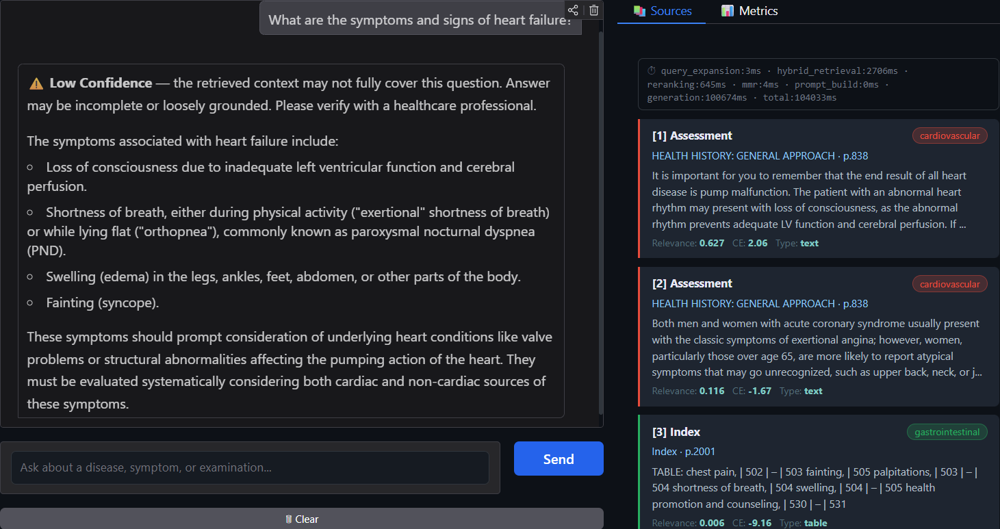
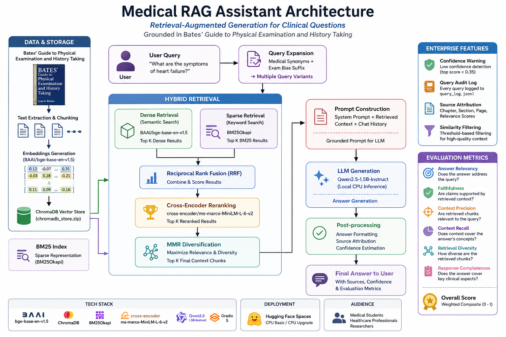

# Medical RAG Assistant

Enterprise-grade Retrieval-Augmented Generation (RAG) system for answering medical and physical examination questions grounded in **Bates' Guide to Physical Examination and History Taking**.

---

## Demo



---

## Features

- Hybrid Retrieval (Dense + BM25)
- Cross-Encoder Reranking
- MMR Diversification
- Query Expansion using Medical Synonyms
- Grounded Generation using Qwen2.5
- Built-in Evaluation Framework
- Source Attribution
- Confidence Estimation
- Audit Logging
- Fully Local CPU Inference
- HuggingFace Spaces Deployable

---

## Architecture



---

## 🔧 Tech Stack

| Component | Model / Library |
|---|---|
| Embeddings | BAAI/bge-base-en-v1.5 |
| Vector DB | ChromaDB |
| Sparse Retrieval | BM25Okapi |
| Reranker | cross-encoder/ms-marco-MiniLM-L-6-v2 |
| LLM | Qwen2.5-1.5B-Instruct |
| Frontend | Gradio 5 |
| Evaluation | Custom RAGAS-inspired metrics |

---

## Pipeline

```text
User Query
    ↓
Query Expansion
    ↓
Hybrid Retrieval
(Dense + BM25)
    ↓
RRF Fusion
    ↓
Cross-Encoder Reranking
    ↓
MMR Diversification
    ↓
Prompt Construction
    ↓
Qwen2.5 Generation
    ↓
Evaluation Metrics
```

---

## Evaluation Metrics

The system evaluates:

- Answer Relevancy
- Faithfulness
- Context Precision
- Context Recall
- Retrieval Diversity
- Response Completeness

---

## Running Locally

### 1. Clone Repo

```bash
git clone https://github.com/sqqshh/Medical-RAG-Assistant.git
cd medical-rag-assistant
```

### 2. Install Dependencies

```bash
pip install -r requirements.txt
```

### 3. Set Environment Variables

```bash
export HF_DATASET_REPO=YOUR_DATASET_REPO
export HF_TOKEN=YOUR_HF_TOKEN
```

### 4. Run

```bash
python app.py
```

---

## HuggingFace Spaces Deployment

This project is fully compatible with HuggingFace Spaces.

Recommended Space Hardware:

- CPU Basic
- CPU Upgrade recommended for faster generation

---

## Dataset

The ChromaDB vector database is stored separately as:

```text
dataset/chromadb_store.zip
```

Loaded dynamically at runtime using HuggingFace Hub.

---

## Disclaimer

This project is for educational purposes only and does not provide medical advice.

Always consult a qualified healthcare professional.

---

YOUR_NAME
